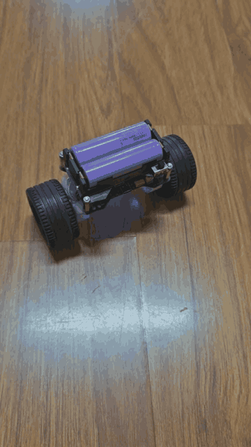
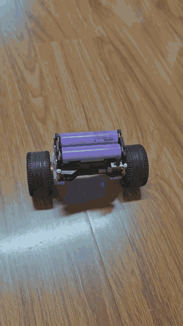

# STM32G4-Balance

基于 STM32G431 + FreeRTOS 的两轮自平衡小车，FOC 磁场定向控制 + 卡尔曼滤波倾角估计。

  

## 硬件

| 组件 | 型号 |
|------|------|
| MCU | STM32G431CBU6 (Cortex-M4F, 170MHz) |
| IMU | MPU6500 (SPI) |
| 编码器 | MT6701 ×2 (SSI/SPI) |
| 电流传感器 | INA240 ×4 (ADC DMA) |
| 栅极驱动 | MP6536 |
| 蓝牙 | doBT-01 (USART2) |
| 电机 | 无刷直流 ×2, 7 对极 |

## 软件架构

```
IMU(SPI) → 卡尔曼滤波(1kHz) → 平衡PD → 速度外环PI(100Hz)
                                      ↓
编码器(SPI DMA) ─────────→ 差分测速     偏航PI(50Hz)
                                      ↓
                              FOC 电流环(20kHz) → SVPWM → 电机
```

### 任务

| 任务 | 周期 | 优先级 | 栈 |
|------|:----:|:------:|:--:|
| TaskBalanceLoop | 1kHz | High | 896w |
| TaskCLI | ~1ms | Normal | 512w |

### 控制回路

- **电流环** — 20kHz, PI + 前馈解耦, Clarke/Park 变换, SVPWM
- **平衡环** — 1kHz, PD (角度P + 角速度D), ±800RPM 限幅
- **速度外环** — 100Hz, PI, 差分测速 ±2RPM 限幅
- **偏航环** — 50Hz, 互补滤波 + PI, ±50RPM 限幅

### 保护

- IWDG 独立看门狗 (8s 超时)
- 倾倒保护 (倾角 >45°或角速度 >350°/s 自动急停)
- 欠压保护 (≤6.4V 停机, ≤6.6V 告警)
- NaN/Inf 全链路防护 (卡尔曼→平衡PID→电流指令)
- HardFault/MemManage/BusFault/UsageFault/NMI 故障关电机

## 构建

```bash
cmake --preset Debug
cmake --build --preset Debug
```

工具链: arm-none-eabi-gcc 13.3.1, CMake + Ninja, STM32Cube FW_G4 V1.6.2, FreeRTOS V10.3.1。

## 串口协议

USART1 (230400, 有线) 和 USART2 (115200, 蓝牙) 共享 CLI:

| 命令 | 功能 |
|------|------|
| `B` | 激活平衡 |
| `STOP` | 紧急停止 |
| `S<RPM>` | 前进速度 |
| `Y<deg/s>` | 目标偏航率 |
| `PK ANG=<v>` | 调整角度P增益 |
| `PK GYR=<v>` | 调整角速度D增益 |
| `?` | 帮助 / 状态显示 |
| `T` | 遥测开关 |

详情见 `docs/COMM_PROTOCOL.md`。

## 许可证

MIT License — 详见 [LICENSE](LICENSE)。

## 免责声明

本项目为个人学习/验证项目，非产品级代码。平衡车涉及物理伤害风险，运行前请确保安全防护措施到位。作者对因使用本代码导致的任何损失不承担责任。
